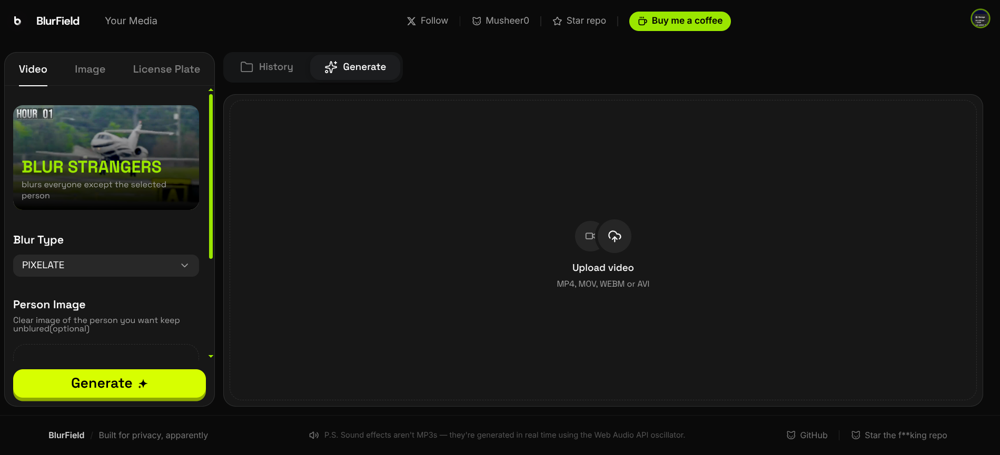
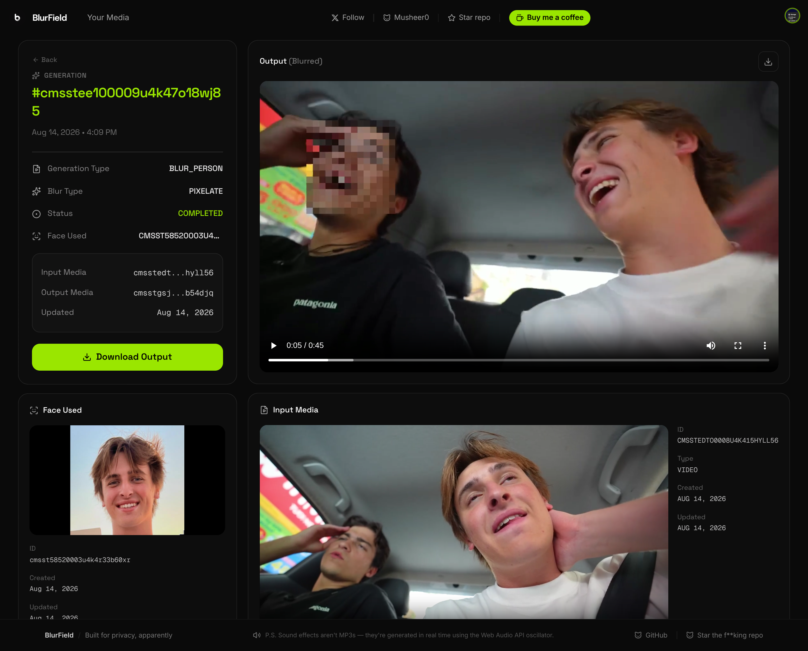

# Blurfield



**Blurfield** is a privacy-focused video face-blurring platform. Upload a video or image and Blurfield automatically detects and blurs other people's faces to protect their privacy — while keeping your own face visible.

## How it works

1. Upload a video (or image) containing other people's faces.
2. Optionally upload a clear photo of your own face.
3. Blurfield automatically blurs everyone else's faces.
4. Download the privacy-safe video and share it without exposing bystanders' identities.

If you upload your face image, Blurfield uses it as the identity to preserve: your face stays visible while every other face in the video is blurred.

## Features

- **Video face blurring** — automatically blur faces in videos
- **Image face blurring** — blur faces in a single image
- **Keep your face visible** — preserve a selected person's face while blurring everyone else
- **Generation history** — review and re-access previous results
- **Media library** — manage all your uploaded media
- **License plate blurring** — coming soon

## Tech stack

- [Next.js 16](https://nextjs.org) (App Router) + TypeScript
- [Tailwind CSS](https://tailwindcss.com) + [shadcn/ui](https://ui.shadcn.com)
- [tRPC](https://trpc.io) + [TanStack Query](https://tanstack.com/query)
- [Prisma](https://www.prisma.io) (PostgreSQL)
- [Zustand](https://github.com/pmndrs/zustand) for editor state
- [S3](https://aws.amazon.com/s3/) for uploads
- [Inngest](https://www.inngest.com) for background generation
- [Upstash](https://upstash.com) rate limiting
- [dodo payments](https://dodopayments.com) for subscriptions

### Backend

The processing backend lives in a separate [Repo](https://github.com/Musheer0/blur-faces-api): a [FastAPI](https://fastapi.tiangolo.com) service using [UniFace](https://github.com/yakhyo/uniface) for face detection, recognition, tracking, and blurring, hosted on [Modal](https://modal.com). The frontend talks to it through a type-safe client generated from its OpenAPI spec.

### API client

The TypeScript client is generated from the backend's OpenAPI spec:

```bash
pnpm gen:client
```

This fetches `${BACKEND_API_URL}/openapi.json` and writes `src/types/blurfield-api.d.ts` (see `scripts/sync-apis.js`). Set `BACKEND_API_URL` to the deployed Modal app URL.

## Getting started

```bash
pnpm install
pnpm dev
```

Open [http://localhost:3000](http://localhost:3000) with your browser.

The app requires environment variables for authentication, database, and storage. See `.env` for the expected values.

## Scripts

| Script          | Description                       |
| --------------- | --------------------------------- |
| `pnpm dev`      | Start the development server      |
| `pnpm build`    | Create a production build         |
| `pnpm start`    | Run the production build          |
| `pnpm lint`     | Lint and type-check with Biome    |
| `pnpm format`   | Format code with Biome            |
| `pnpm gen:client` | Regenerate tRPC client APIs     |


## Environment Variables

Create a `.env` file in the project root and configure the following variables:

### Authentication

```env
GOOGLE_CLIENT_ID=
GOOGLE_CLIENT_SECRET=
GOOGLE_CLIENT_REDIRECT=
JWT_SECRET=
````

### Database

```env
DATABASE_URL=
```

### Redis — Upstash

```env
UPSTASH_REDIS_REST_URL=
UPSTASH_REDIS_REST_TOKEN=
```

### S3 Storage

```env
AWS_ACCESS_KEY_ID=
AWS_SECRET_ACCESS_KEY=
AWS_ENDPOINT_URL_S3=
AWS_ENDPOINT_URL_IAM=
AWS_REGION=auto
S3_BUCKET=
```

### Backend

```env
BACKEND_API_KEY=
BACKEND_API_URL=
```

### Dodo Payments

```env
DODO_WH_SECRET=
DODO_PAYMENTS_API_KEY=
PRODUCT_ID=
```

* `DODO_WH_SECRET` — Secret used to verify Dodo Payments webhook requests.
* `DODO_PAYMENTS_API_KEY` — API key used to communicate with Dodo Payments.
* `PRODUCT_ID` — Dodo Payments product ID used for subscriptions/payments.

### Inngest

For local development:

```env
INNGEST_DEV=1
```

### Application

```env
APP= Public URL of the frontend application, used for redirects and application-level configuration.
```
## All Environment Variables

Copy this into your `.env` file and fill in the values:

```env
# Authentication
GOOGLE_CLIENT_ID=
GOOGLE_CLIENT_SECRET=
GOOGLE_CLIENT_REDIRECT=
JWT_SECRET=

# Database
DATABASE_URL=

# Upstash Redis
UPSTASH_REDIS_REST_URL=
UPSTASH_REDIS_REST_TOKEN=

# S3 Storage
AWS_ACCESS_KEY_ID=
AWS_SECRET_ACCESS_KEY=
AWS_ENDPOINT_URL_S3=
AWS_ENDPOINT_URL_IAM=
AWS_REGION=auto
S3_BUCKET=

# Backend
BACKEND_API_KEY=
BACKEND_API_URL=

# Dodo Payments
DODO_WH_SECRET=
DODO_PAYMENTS_API_KEY=
PRODUCT_ID=

# Inngest
INNGEST_DEV=1

# Application
APP=
```
